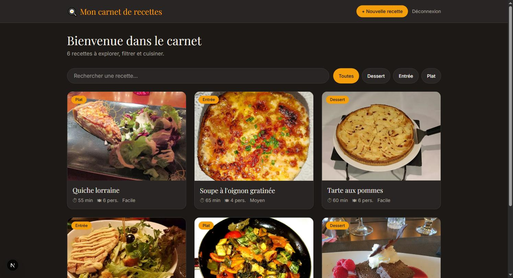
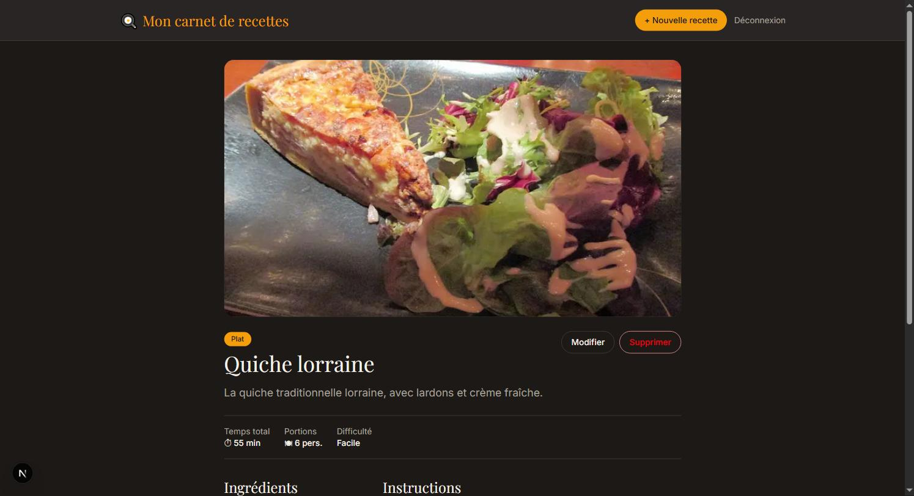
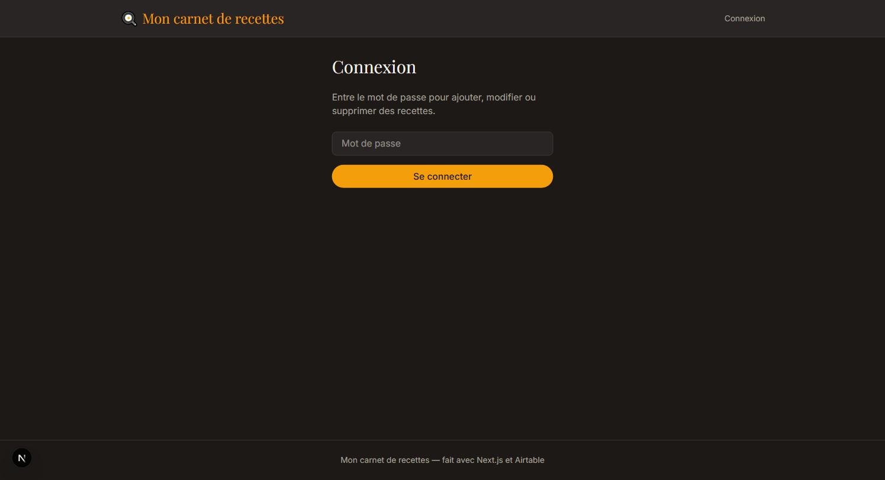
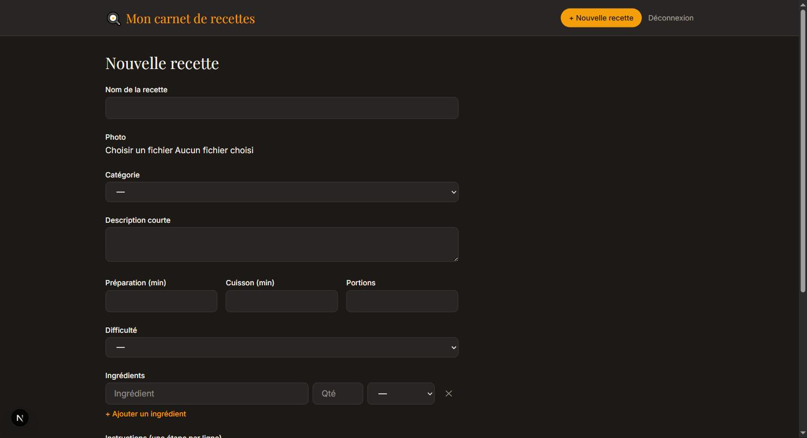

# Fonctionnalités

Tour des fonctionnalités de l'application, avec captures d'écran.

## Sans être connecté

N'importe quel visiteur peut :

- **Parcourir** toutes les recettes depuis l'accueil, sous forme de cartes avec photo
- **Rechercher** une recette par son nom (champ de recherche en haut de l'accueil)
- **Filtrer** par catégorie (Entrée, Plat, Dessert)
- **Consulter le détail** d'une recette : photo, temps de préparation/cuisson, nombre de portions, difficulté, liste des ingrédients avec quantités, et instructions numérotées étape par étape

## Se connecter

Le bouton **Connexion** (en haut à droite) mène à un formulaire demandant un mot de passe. Sans le bon mot de passe, impossible de créer, modifier ou supprimer une recette — ces pages redirigent automatiquement vers la connexion.

Mot de passe par défaut du projet : **`recettes2026`** (modifiable via la variable `APP_PASSWORD`, voir [`01-demarrage.md`](01-demarrage.md)).

## Une fois connecté

En plus de tout ce qui précède, un utilisateur connecté peut :

- **Créer une nouvelle recette** (bouton « + Nouvelle recette ») : titre, photo, catégorie, description, temps de préparation/cuisson, portions, difficulté, liste d'ingrédients (avec quantité et unité — possibilité de choisir un ingrédient déjà existant ou d'en taper un nouveau, créé automatiquement) et instructions (une étape par ligne)
- **Modifier** une recette existante (bouton « Modifier » sur sa page détail), avec le même formulaire pré-rempli
- **Supprimer** une recette (bouton « Supprimer » sur sa page détail, avec une confirmation avant suppression définitive)
- **Se déconnecter** (bouton « Déconnexion »)

## D'où viennent les données

Toutes les recettes, catégories et ingrédients affichés sont stockés dans Airtable, pas dans le code de l'application. Voir [`02-airtable.md`](02-airtable.md) pour le détail du schéma des tables et comment y accéder.
